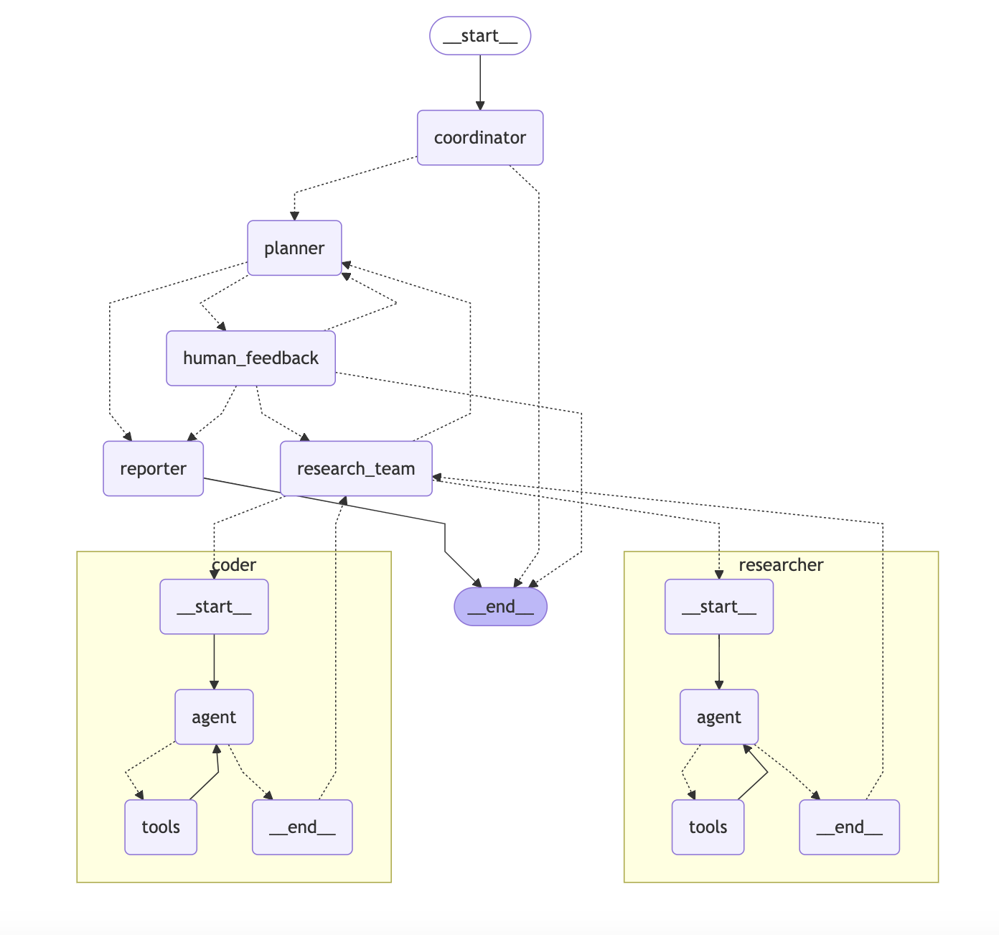

# 🔍 ResearcherNexus

[](https://www.python.org/downloads/)
[](https://opensource.org/licenses/MIT)

[English](./README_en.md) | [简体中文](./README.md) | [日本語](./README_ja.md)

> 源于开源，回馈开源。

**ResearcherNexus**是一个社区驱动的深度研究框架，将语言模型与专业工具结合，用于网络搜索、网页爬取和Python代码执行等任务，同时回馈使这一切成为可能的开源社区。**ResearcherNexus**使用现代化的[多代理系统](https://zhida.zhihu.com/search?content_id=257568510&content_type=Article&match_order=1&q=多代理系统&zhida_source=entity)架构，通过[LangGraph](https://zhida.zhihu.com/search?content_id=257568510&content_type=Article&match_order=1&q=LangGraph&zhida_source=entity)框架实现灵活的基于状态的工作流程，通过一套明确定义的消息传递系统实现组件间通信。其核心设计思想是将复杂的研究过程拆分为可管理的阶段，由专门的AI代理负责处理，从而实现高效、全面的自动化研究。

请访问[ResearcherNexus的官方网站](https://www.SASS.org.cn/)了解更多详情。

## 新增功能

### 🔐 用户认证系统

ResearcherNexus现在支持完整的用户认证功能，提供安全且用户友好的访问控制：

#### 用户注册
- **简单注册流程**：新用户可以通过用户名和密码创建账号
- **输入验证**：
  - 用户名：3-20位字符，只能包含字母、数字和下划线
  - 密码：至少6位字符
  - 重复密码确认
- **重复检查**：系统自动检查用户名是否已被使用
- **默认权限**：新注册用户默认为普通用户，每日使用限制10次

#### 用户登录
- **安全登录**：用户通过用户名和密码进行身份验证
- **角色识别**：系统自动识别用户角色（管理员/普通用户）
- **智能跳转**：
  - 管理员登录后跳转到管理面板
  - 普通用户登录后跳转到聊天界面
- **状态保持**：登录状态在浏览器会话中保持

#### 访问控制
- **路由保护**：未登录用户无法访问核心功能
- **自动重定向**：访问受保护页面时自动跳转到登录页面
- **用户信息显示**：登录后在界面中显示用户名和角色信息
- **安全退出**：提供安全的登出功能

### 📊 用户使用限制系统

为了合理管理系统资源和提供公平的服务，ResearcherNexus实现了智能的使用限制机制：

#### 使用次数管理
- **每日限制**：每个用户都有每日使用次数限制
  - 普通用户：默认10次/天
  - 管理员：999次/天（几乎无限制）
- **实时计数**：每次与AI对话都会消耗一次使用机会
- **自动重置**：每日使用次数在新的一天自动重置为0
- **智能检测**：系统基于日期自动判断是否需要重置计数

#### 使用状态显示
- **剩余次数显示**：用户可以实时查看今日剩余使用次数
- **使用进度**：显示"已使用/总限制"的清晰格式
- **限制提醒**：当达到使用限制时显示友好的提示信息
- **状态更新**：使用次数实时更新，无需刷新页面

#### 限制机制
- **使用前检查**：每次对话前检查是否还有剩余次数
- **优雅降级**：达到限制时显示明确的错误信息
- **次日恢复**：用户可以在第二天继续使用服务

### 🛠️ 管理员后台系统

ResearcherNexus提供了功能强大的管理员后台，让管理员能够有效管理用户和系统资源：

#### 用户管理功能
- **用户列表查看**：查看所有注册用户的详细信息
  - 用户名、角色、每日限制
  - 今日已用次数、剩余次数
  - 最后使用日期
- **权限管理**：查看和区分管理员与普通用户
- **使用统计**：实时查看每个用户的使用情况

#### 限制管理功能
- **动态调整限制**：管理员可以为任何用户调整每日使用限制
- **批量管理**：支持对多个用户进行批量操作
- **即时生效**：限制调整立即生效，无需重启系统
- **灵活配置**：可以设置0到任意数值的使用限制

#### 使用重置功能
- **手动重置**：管理员可以手动重置任何用户的今日使用次数
- **紧急恢复**：为重要用户提供紧急使用次数恢复
- **操作记录**：所有管理操作都有清晰的界面反馈

#### 管理员权限
- **默认管理员**：系统预设管理员账户
  - 用户名：`admin`
  - 密码：`admin123`
- **权限控制**：只有管理员角色才能访问管理后台
- **安全访问**：管理后台路径为 `/admin`

### 💾 数据存储

系统使用简单且可靠的CSV文件存储用户数据：

#### CSV文件结构
```csv
username,password,role,daily_limit,used_today,last_used_date
admin,admin123,admin,999,0,
user,password,user,10,5,2025-01-27
test,test123,user,10,0,
```

#### 字段说明
- `username`：用户名（唯一标识）
- `password`：密码（明文存储，仅用于演示）
- `role`：用户角色（admin/user）
- `daily_limit`：每日使用限制次数
- `used_today`：今日已使用次数
- `last_used_date`：最后使用日期（YYYY-MM-DD格式）

#### 数据管理
- **自动备份**：系统自动维护数据文件的完整性
- **实时更新**：用户操作实时反映到CSV文件中
- **易于维护**：管理员可以直接编辑CSV文件进行批量操作

### 🎯 使用流程

#### 新用户流程
1. 访问主页 `http://localhost:3000`
2. 点击"注册账户"按钮
3. 填写用户名和密码信息
4. 提交注册，系统自动创建账户
5. 跳转到登录页面，使用新账户登录
6. 开始使用ResearcherNexus进行研究

#### 现有用户流程
1. 访问主页或直接访问登录页面
2. 输入用户名和密码
3. 登录成功后根据角色跳转：
   - 管理员 → 管理面板
   - 普通用户 → 聊天界面
4. 查看剩余使用次数
5. 开始研究对话

#### 管理员流程
1. 使用管理员账户登录
2. 访问管理面板查看用户列表
3. 根据需要调整用户的使用限制
4. 监控系统使用情况
5. 必要时重置用户的使用次数

通过主页的"开始研究"按钮，您将被引导至登录页面，完成身份验证后即可使用所有研究工具。

## 项目价值

ResearcherNexus定位为一个深度研究框架，专注于以下几个方面：

1. **自动化研究流程**：将复杂的研究任务分解为可管理的步骤，并由专门的代理自动执行。
2. **多模态内容创建**：支持生成研究报告、播客和演示文稿等多种类型的内容。
3. **[人机协作](https://zhida.zhihu.com/search?content_id=257568510&content_type=Article&match_order=1&q=人机协作&zhida_source=entity)**：通过人在环系统(human-in-the-loop)，使用户能够以自然语言交互方式修改研究计划。
4. **工具融合**：无缝集成各种研究工具和方法，**支持MCP**，包括网络搜索、网页爬取和代码执行等。

---


## 📑 目录

- [🚀 快速开始](#快速开始)
- [🌟 特性](#特性)
- [🏗️ 架构](#架构)
- [🔄 LangSmith集成](#langsmith集成)
- [🛠️ 开发](#开发)
- [🗣️ 文本转语音集成](#文本转语音集成)
- [📚 示例](#示例)
- [❓ 常见问题](#常见问题)
- [📜 许可证](#许可证)
- [💖 致谢](#致谢)
- [⭐ Star History](#star-History)


## 快速开始

ResearcherNexus使用Python开发，并配有用Node.js编写的Web UI。为确保顺利的设置过程，我们推荐使用以下工具：

### 推荐工具
- **[`uv`](https://docs.astral.sh/uv/getting-started/installation/):**
  简化Python环境和依赖管理。`uv`会自动在根目录创建虚拟环境并为您安装所有必需的包—无需手动安装Python环境。

- **[`nvm`](https://github.com/nvm-sh/nvm):**
  轻松管理多个Node.js运行时版本。

- **[`pnpm`](https://pnpm.io/installation):**
  安装和管理Node.js项目的依赖。

### 环境要求
确保您的系统满足以下最低要求：
- **[Python](https://www.python.org/downloads/):** 版本 `3.12+`
- **[Node.js](https://nodejs.org/en/download/):** 版本 `22+`

### 安装
```bash
# 克隆仓库
git clone 🔍https://github.com/wuxixixi/ResearcherNexus.git
cd ResearcherNexus

# 安装依赖，uv将负责Python解释器和虚拟环境的创建，并安装所需的包
uv sync

# 使用您的API密钥配置.env
# Tavily: https://app.tavily.com/home
# Brave_SEARCH: https://brave.com/search/api/
# 火山引擎TTS: 如果您有TTS凭证，请添加
cp .env.example .env

# 查看下方的"支持的搜索引擎"和"文本转语音集成"部分了解所有可用选项

# 为您的LLM模型和API密钥配置conf.yaml
# 请参阅'docs/configuration_guide.md'获取更多详情
cp conf.yaml.example conf.yaml

# 安装marp用于PPT生成
# https://github.com/marp-team/marp-cli?tab=readme-ov-file#use-package-manager
brew install marp-cli
```

可选，通过[pnpm](https://pnpm.io/installation)安装Web UI依赖：

```bash
cd ResearcherNexus/web
pnpm install
```

### 配置

请参阅[配置指南](docs/configuration_guide.md)获取更多详情。

> [!注意]
> 在启动项目之前，请仔细阅读指南，并更新配置以匹配您的特定设置和要求。

### 控制台UI

运行项目的最快方法是使用控制台UI。

```bash
# 在类bash的shell中运行项目
uv run main.py
```

### Web UI

本项目还包括一个Web UI，提供更加动态和引人入胜的交互体验。
> [!注意]
> 您需要先安装Web UI的依赖。

```bash
# 在开发模式下同时运行后端和前端服务器
# 在macOS/Linux上
./bootstrap.sh -d

# 在Windows上
bootstrap.bat -d
```

打开浏览器并访问[`http://localhost:3000`](http://localhost:3000)探索Web UI。

在[`web`](./web/)目录中探索更多详情。


## 支持的搜索引擎

RearcherNexus支持多种搜索引擎，可以在`.env`文件中通过`SEARCH_API`变量进行配置：

- **Tavily**（默认）：专为AI应用设计的专业搜索API
    - 需要在`.env`文件中设置`TAVILY_API_KEY`
    - 注册地址：https://app.tavily.com/home

- **DuckDuckGo**：注重隐私的搜索引擎
    - 无需API密钥

- **Brave Search**：具有高级功能的注重隐私的搜索引擎
    - 需要在`.env`文件中设置`BRAVE_SEARCH_API_KEY`
    - 注册地址：https://brave.com/search/api/

- **Arxiv**：用于学术研究的科学论文搜索
    - 无需API密钥
    - 专为科学和学术论文设计

要配置您首选的搜索引擎，请在`.env`文件中设置`SEARCH_API`变量：

```bash
# 选择一个：tavily, duckduckgo, brave_search, arxiv
SEARCH_API=tavily
```

## 特性

### 核心能力

- 🤖 **LLM集成**
    - 通过[litellm](https://docs.litellm.ai/docs/providers)支持集成大多数模型
    - 支持开源模型如Qwen
    - 兼容OpenAI的API接口
    - 多层LLM系统适用于不同复杂度的任务

### 工具和MCP集成

- 🔍 **搜索和检索**
    - 通过Tavily、Brave Search等进行网络搜索
    - 使用Jina进行爬取
    - 高级内容提取

- 🔗 **MCP无缝集成**
    - 扩展私有域访问、知识图谱、网页浏览等能力
    - 促进多样化研究工具和方法的集成

### 人机协作

- 🧠 **人在环中**
    - 支持使用自然语言交互式修改研究计划
    - 支持自动接受研究计划

- 📝 **报告后期编辑**
    - 支持类Notion的块编辑
    - 允许AI优化，包括AI辅助润色、句子缩短和扩展
    - 由[tiptap](https://tiptap.dev/)提供支持

### 内容创作

- 🎙️ **播客和演示文稿生成**
    - AI驱动的播客脚本生成和音频合成
    - 自动创建简单的PowerPoint演示文稿
    - 可定制模板以满足个性化内容需求


## 架构

RearcherNexus实现了一个模块化的多智能体系统架构，专为自动化研究和代码分析而设计。该系统基于LangGraph构建，实现了灵活的基于状态的工作流，其中组件通过定义良好的消息传递系统进行通信。




系统采用了精简的工作流程，包含以下组件：

1. **协调器**：管理工作流生命周期的入口点
   - 根据用户输入启动研究过程
   - 在适当时候将任务委派给规划器
   - 作为用户和系统之间的主要接口

2. **规划器**：负责任务分解和规划的战略组件
   - 分析研究目标并创建结构化执行计划
   - 确定是否有足够的上下文或是否需要更多研究
   - 管理研究流程并决定何时生成最终报告

3. **研究团队**：执行计划的专业智能体集合：
   - **研究员**：使用网络搜索引擎、爬虫甚至MCP服务等工具进行网络搜索和信息收集。
   - **编码员**：使用Python REPL工具处理代码分析、执行和技术任务。
   每个智能体都可以访问针对其角色优化的特定工具，并在LangGraph框架内运行

4. **报告员**：研究输出的最终阶段处理器
   - 汇总研究团队的发现
   
   - 处理和组织收集的信息
   
   - 生成全面的研究报告
   
     

# 文件夹结构

```
ResearcherNexus/
├── src/                     # 核心源代码目录
│   ├── agents/              # 代理定义和实现
│   ├── config/              # 配置管理
│   ├── crawler/             # 网页爬取功能
│   ├── graph/               # LangGraph工作流定义
│   ├── llms/                # 语言模型集成
│   ├── podcast/             # 播客生成功能
│   ├── ppt/                 # 演示文稿生成
│   ├── prompts/             # 提示模板
│   ├── prose/               # 文本处理功能
│   ├── server/              # 服务器实现
│   ├── tools/               # 工具集成(搜索、爬取、代码执行)
│   └── utils/               # 通用工具函数
├── web/                     # Web UI实现(基于Next.js)
│   ├── src/                 # Web UI源代码
│   ├── public/              # 静态资源
├── examples/                # 示例研究报告
├── tests/                   # 测试代码
├── docs/                    # 文档
└── assets/                  # 资源文件
```


## 文本转语音集成

ResarcherNexus现在包含一个文本转语音(TTS)功能，允许您将研究报告转换为语音。此功能使用火山引擎TTS API生成高质量的文本音频。速度、音量和音调等特性也可以自定义。

### 使用TTS API

您可以通过`/api/tts`端点访问TTS功能：

```bash
# 使用curl的API调用示例
curl --location 'http://localhost:8000/api/tts' \
--header 'Content-Type: application/json' \
--data '{
    "text": "这是文本转语音功能的测试。",
    "speed_ratio": 1.0,
    "volume_ratio": 1.0,
    "pitch_ratio": 1.0
}' \
--output speech.mp3
```


## 开发

### 测试

运行测试套件：

```bash
# 运行所有测试
make test

# 运行特定测试文件
pytest tests/integration/test_workflow.py

# 运行覆盖率测试
make coverage
```

### 代码质量

```bash
# 运行代码检查
make lint

# 格式化代码
make format
```

### 使用LangGraph Studio进行调试

ResarcherNexus使用LangGraph作为其工作流架构。您可以使用LangGraph Studio实时调试和可视化工作流。

#### 本地运行LangGraph Studio

RearcherNexus包含一个`langgraph.json`配置文件，该文件定义了LangGraph Studio的图结构和依赖关系。该文件指向项目中定义的工作流图，并自动从`.env`文件加载环境变量。

##### Mac

```bash
# 如果您没有uv包管理器，请安装它
curl -LsSf https://astral.sh/uv/install.sh | sh

# 安装依赖并启动LangGraph服务器
uvx --refresh --from "langgraph-cli[inmem]" --with-editable . --python 3.12 langgraph dev --allow-blocking
```

##### Windows / Linux

```bash
# 安装依赖
pip install -e .
pip install -U "langgraph-cli[inmem]"

# 启动LangGraph服务器
langgraph dev
```

启动LangGraph服务器后，您将在终端中看到几个URL：
- API: http://127.0.0.1:2024
- Studio UI: https://smith.langchain.com/studio/?baseUrl=http://127.0.0.1:2024
- API文档: http://127.0.0.1:2024/docs

在浏览器中打开Studio UI链接以访问调试界面。

#### 使用LangGraph Studio

在Studio UI中，您可以：

1. 可视化工作流图并查看组件如何连接
2. 实时跟踪执行情况，了解数据如何在系统中流动
3. 检查工作流每个步骤的状态
4. 通过检查每个组件的输入和输出来调试问题
5. 在规划阶段提供反馈以完善研究计划

当您在Studio UI中提交研究主题时，您将能够看到整个工作流执行过程，包括：
- 创建研究计划的规划阶段
- 可以修改计划的反馈循环
- 每个部分的研究和写作阶段
- 最终报告生成

## 示例

以下示例展示了RearcherNexus的功能：

### 研究报告

1. **OpenAI Sora报告** - OpenAI的Sora AI工具分析
   - 讨论功能、访问方式、提示工程、限制和伦理考虑
   - [查看完整报告](examples/openai_sora_report.md)

2. **Google的Agent to Agent协议报告** - Google的Agent to Agent (A2A)协议概述
   - 讨论其在AI智能体通信中的作用及其与Anthropic的Model Context Protocol (MCP)的关系
   - [查看完整报告](examples/what_is_agent_to_agent_protocol.md)

3. **什么是MCP？** - 对"MCP"一词在多个上下文中的全面分析
   - 探讨AI中的Model Context Protocol、化学中的Monocalcium Phosphate和电子学中的Micro-channel Plate
   - [查看完整报告](examples/what_is_mcp.md)

4. **比特币价格波动** - 最近比特币价格走势分析
   - 研究市场趋势、监管影响和技术指标
   - 基于历史数据提供建议
   - [查看完整报告](examples/bitcoin_price_fluctuation.md)

5. **什么是LLM？** - 对大型语言模型的深入探索
   - 讨论架构、训练、应用和伦理考虑
   - [查看完整报告](examples/what_is_llm.md)

6. **如何使用Claude进行深度研究？** - 在深度研究中使用Claude的最佳实践和工作流程
   - 涵盖提示工程、数据分析和与其他工具的集成
   - [查看完整报告](examples/how_to_use_claude_deep_research.md)

7. **医疗保健中的AI采用：影响因素** - 影响医疗保健中AI采用的因素分析
   - 讨论AI技术、数据质量、伦理考虑、经济评估、组织准备度和数字基础设施
   - [查看完整报告](examples/AI_adoption_in_healthcare.md)

8. **量子计算对密码学的影响** - 量子计算对密码学影响的分析
   - 讨论经典密码学的漏洞、后量子密码学和抗量子密码解决方案
   - [查看完整报告](examples/Quantum_Computing_Impact_on_Cryptography.md)

9. **克里斯蒂亚诺·罗纳尔多的表现亮点** - 克里斯蒂亚诺·罗纳尔多表现亮点的分析
   - 讨论他的职业成就、国际进球和在各种比赛中的表现
   - [查看完整报告](examples/Cristiano_Ronaldo's_Performance_Highlights.md)

要运行这些示例或创建您自己的研究报告，您可以使用以下命令：

```bash
# 使用特定查询运行
uv run main.py "哪些因素正在影响医疗保健中的AI采用？"

# 使用自定义规划参数运行
uv run main.py --max_plan_iterations 3 "量子计算如何影响密码学？"

# 在交互模式下运行，带有内置问题
uv run main.py --interactive

# 或者使用基本交互提示运行
uv run main.py

# 查看所有可用选项
uv run main.py --help
```

### 交互模式

应用程序现在支持带有英文和中文内置问题的交互模式：

1. 启动交互模式：
   ```bash
   uv run main.py --interactive
   ```

2. 选择您偏好的语言（English或中文）

3. 从内置问题列表中选择或选择提出您自己问题的选项

4. 系统将处理您的问题并生成全面的研究报告

### 人在环中

RearcherNexus包含一个人在环中机制，允许您在执行研究计划前审查、编辑和批准：

1. **计划审查**：启用人在环中时，系统将在执行前向您展示生成的研究计划

2. **提供反馈**：您可以：
   - 通过回复`[ACCEPTED]`接受计划
   - 通过提供反馈编辑计划（例如，`[EDIT PLAN] 添加更多关于技术实现的步骤`）
   - 系统将整合您的反馈并生成修订后的计划

3. **自动接受**：您可以启用自动接受以跳过审查过程：
   
- 通过API：在请求中设置`auto_accepted_plan: true`
  
4. **API集成**：使用API时，您可以通过`feedback`参数提供反馈：
   ```json
   {
     "messages": [{"role": "user", "content": "什么是量子计算？"}],
     "thread_id": "my_thread_id",
     "auto_accepted_plan": false,
     "feedback": "[EDIT PLAN] 包含更多关于量子算法的内容"
   }
   ```

### 命令行参数

应用程序支持多个命令行参数来自定义其行为：

- **query**：要处理的研究查询（可以是多个词）
- **--interactive**：以交互模式运行，带有内置问题
- **--max_plan_iterations**：最大规划周期数（默认：1）
- **--max_step_num**：研究计划中的最大步骤数（默认：3）
- **--debug**：启用详细调试日志

## 常见问题

请参阅[FAQ.md](docs/FAQ.md)获取更多详情。

## 许可证

本项目是开源的，遵循[MIT许可证](./LICENSE)。

## 致谢

RearcherNexus建立在开源社区的杰出工作基础之上。我们深深感谢所有使RearcherNexus成为可能的项目和贡献者。诚然，我们站在巨人的肩膀上。

我们要向以下项目表达诚挚的感谢，感谢他们的宝贵贡献：

- **[LangChain](https://github.com/langchain-ai/langchain)**：他们卓越的框架为我们的LLM交互和链提供动力，实现了无缝集成和功能。
- **[LangGraph](https://github.com/langchain-ai/langgraph)**：他们在多智能体编排方面的创新方法对于实现RearcherNexus复杂工作流至关重要。

这些项目展示了开源协作的变革力量，我们很自豪能够在他们的基础上构建。

### 核心贡献者
衷心感谢`RearcherNexus`的核心作者，他们的愿景、热情和奉献使这个项目得以实现：

- **[Daniel Walnut](https://github.com/hetaoBackend/)**
- **[Henry Li](https://github.com/magiccube/)**

您坚定不移的承诺和专业知识是RearcherNexus成功的驱动力。我们很荣幸有您引领这一旅程。

## Star History

[](https://star-history.com/#wuxixixi/ResearcherNexus&Date)

## LangSmith集成

ResearcherNexus 集成了 LangSmith 用于跟踪、监控和调试 LLM 应用。通过 LangSmith，您可以：

- 跟踪所有代理交互和工作流执行
- 分析模型性能和响应
- 调试复杂的多代理交互
- 优化提示和工作流

### 配置 LangSmith

1. 首先在 [LangSmith](https://smith.langchain.com/) 注册并获取 API 密钥
2. 在 `.env` 文件中添加以下配置：

```bash
# LangSmith 配置
LANGCHAIN_API_KEY=your_api_key_here
LANGCHAIN_PROJECT=ResearchNexus
LANGCHAIN_TRACING=true
# 可选配置
# LANGCHAIN_ENDPOINT=https://api.smith.langchain.com
# LANGCHAIN_TAGS=prod,v1,research
```

### 查看和分析跟踪数据

配置完成后，ResearcherNexus 的所有运行都会自动记录到 LangSmith 平台。您可以：

1. 登录 [LangSmith Dashboard](https://smith.langchain.com/projects) 查看您的项目
2. 分析每个代理的性能和交互
3. 查看完整的执行路径和中间结果
4. 提取有用的见解以优化您的研究流程

### 在代码中使用 LangSmith

ResearcherNexus 提供了 `src/utils/langsmith_helper.py` 工具，可以直接在代码中访问 LangSmith 数据：

```python
from src.utils.langsmith_helper import get_recent_runs, get_project_stats

# 获取最近的运行记录
recent_runs = get_recent_runs(days=1, limit=10)

# 获取项目统计信息
stats = get_project_stats(days=7)
print(f"成功率: {stats['success_rate']}%, 平均延迟: {stats['avg_latency']}秒")
```

LangSmith 集成对于开发人员和研究人员了解复杂工作流的行为和性能至关重要，尤其是在处理多代理系统时。
